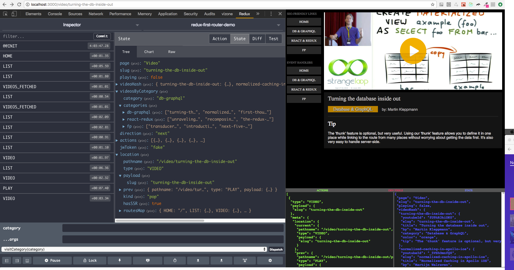

# Universal Demonstration of [Redux-First Router](https://github.com/faceyspacey/redux-first-router)



## Installation

```
git clone https://github.com/faceyspacey/redux-first-router-demo
cd redux-first-router-demo
yarn start
```


## Files You Should Look At:

*universal code:*
- [***src/routesMap.js***](./src/routesMap.js) - *(observe thunks and `onBeforeChange`)*
- [***src/utils.js***](./src/utils.js) - *(check `isAllowed` function)*

*client code:*
- [***src/configureStore.js***](./src/configureStore.js) - *(nothing new here)*
- [***src/components/Switcher.js***](./src/components/Switcher.js) - *(universal component concept)*
- [***src/components/UniversalComponent.js***](./src/components/UniversalComponent.js) - ***(universal component concept continued...)***
- [***src/components/Sidebar.js***](./src/components/Sidebar.js) - *(look at the different ways to link + dispatch URL-aware actions)*
- [***src/reducers/index.js***](./src/reducers/index.js) -  *(observe simplicity of the `page` reducer. Also be cognizant of non-route action types)*


*server code:*
- [***server/index.js***](./server/index.js) - *(built-in ajax API + fake cookie handling)*
- [***server/render.js***](./server/render.js) - *(super simple thanks to [webpack-flush-chunks](https://github.com/faceyspacey/webpack-flush-chunks))*
- [***server/configureStore.js***](./server/configureStore.js) - ***(this is the gem of the repo -- observe how to filter authentication)***

## Notes
There are various things you can try in the comments by toggling simple values. I label them *"TRY:"* and *"TASK."* This is all about SSR. It shows how to use the `onBeforeChange` to properly authenticate user's and routes using *JSON Web Tokens*. 

The [***server/configureStore.js***](./server/configureStore.js) file is the absolute most important file of the demo. It essentially brings your *routing-aware Redux store* full circle in a dead simple yet flexible manner. It works in combination with [***src/routesMap.js***](./src/routesMap.js). Study those are your redux routing dreams have come true 😀

As a bonus, it comes with code-splitting. This setup makes code-splitting stupid-easy. In the future, *routing-aware pre-fetching* will be added to the mix, so the users never know you're only serving partial parts of your app 🚀


## TO DO

- auth0-based complete signup/login that replaces current fake cookie/JWToken setup *(PR welcome)*
